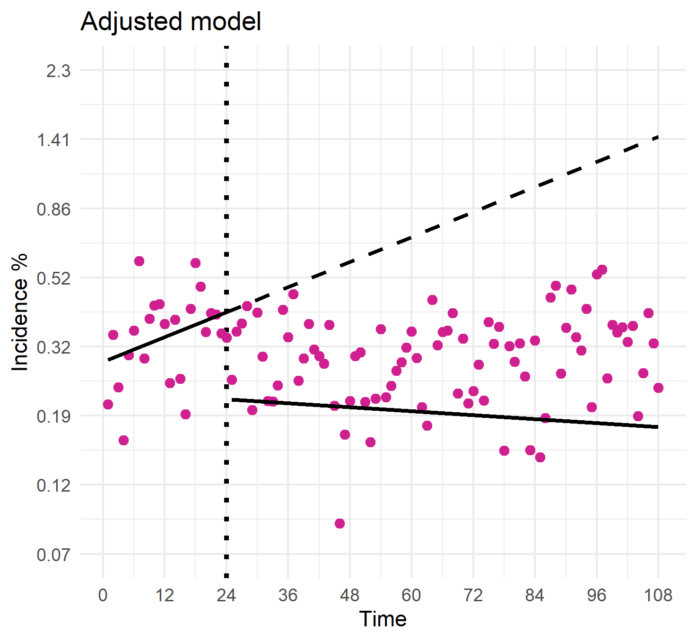
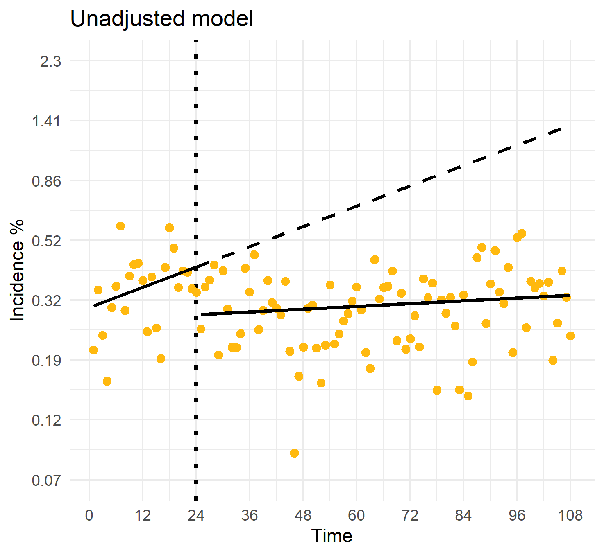

If you read textbooks and blogs about regression, you'll usually see scatterplots with lines of best fit through them. These tend to disappear when you get to examples of larger multivariable models. Recently, I've been trying to make some visualizations of multivariable logistic models by overlaying them on aggregated proportions but they just don't pass the eyeball test. I wasn't expecting it to look perfect; The underlying model was created with individual level data (not aggregated) and the confounder ajdustments should affect the shape but it just looks wrong. Here's an example of the log odds of an outcome through time with transformed axis labels:
  
```{r, out.width = "400px", echo = FALSE, fig.align = 'center'}

``` 

This was created with a technique called segmented regression where we fit an additional slope and intercept to measure changes at or following an intervention (dotted line). The predicted incidence in post intervention period seems far too low and it can't be attributed to differing counts of the months. When you create this plot without the confounder adjustments, it looks much more believable:  
  

```{r, out.width = "400px", echo = FALSE, fig.align = 'center'}

```
  
Trying to figure out why this happens lead me to learn two things which, although they originated from the same place, don't actually have that much to do with each other. As a result, I wrote two separate blurbs:  
  
1. [Marginal standardization](https://svenhalvorson.github.io/party_page/portfolio/marginal_standardization): a method for producing population wide statistics from a logistic model.  
2. [The effect of confounders on regression plots](https://svenhalvorson.github.io/party_page/portfolio/regression_simulation): some simulations I created too look at the conditions that cause the 'off center' graphs above.  
  
I hope you enjoy! If you have questions or think that I'm grossly mistaken, feel free to email me at svenpubmail@gmail.com

